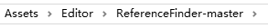
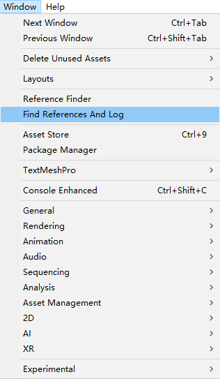
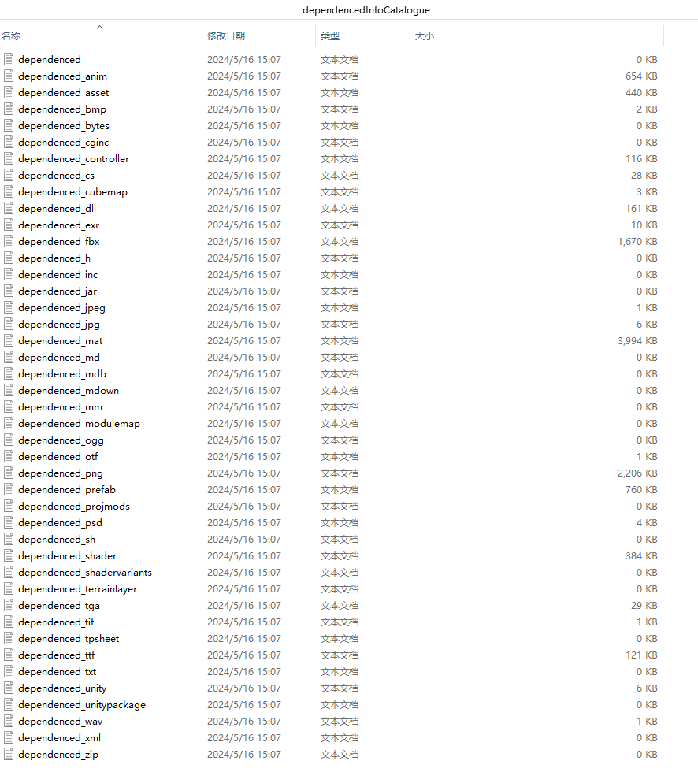
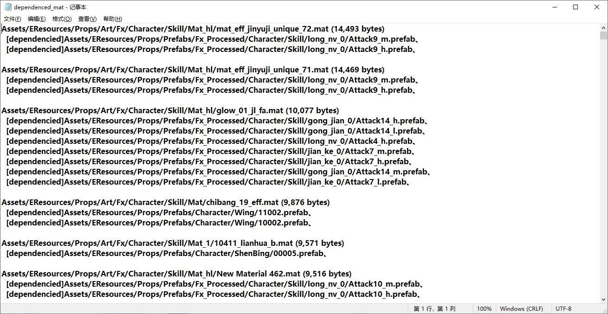
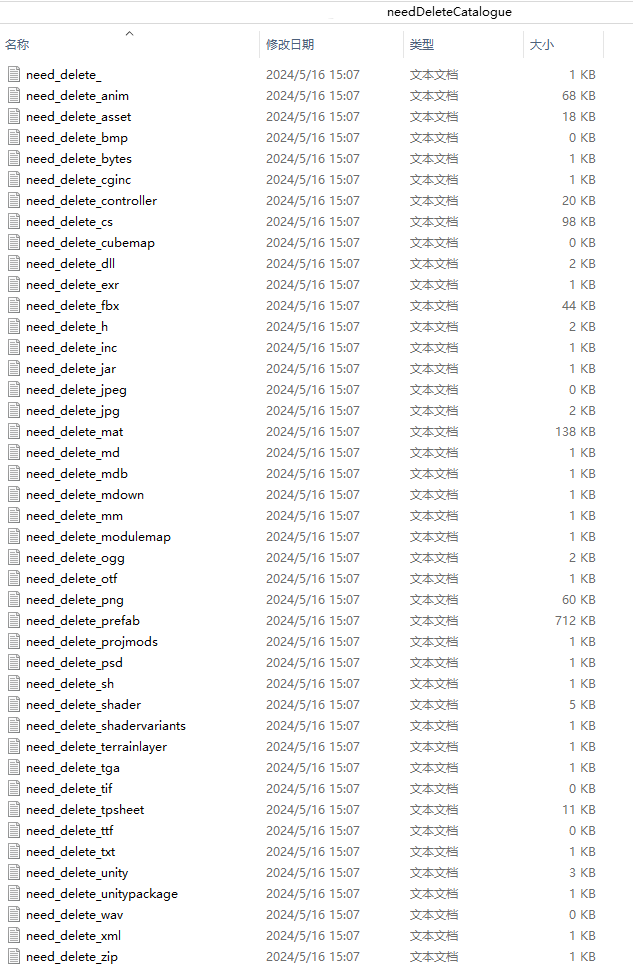
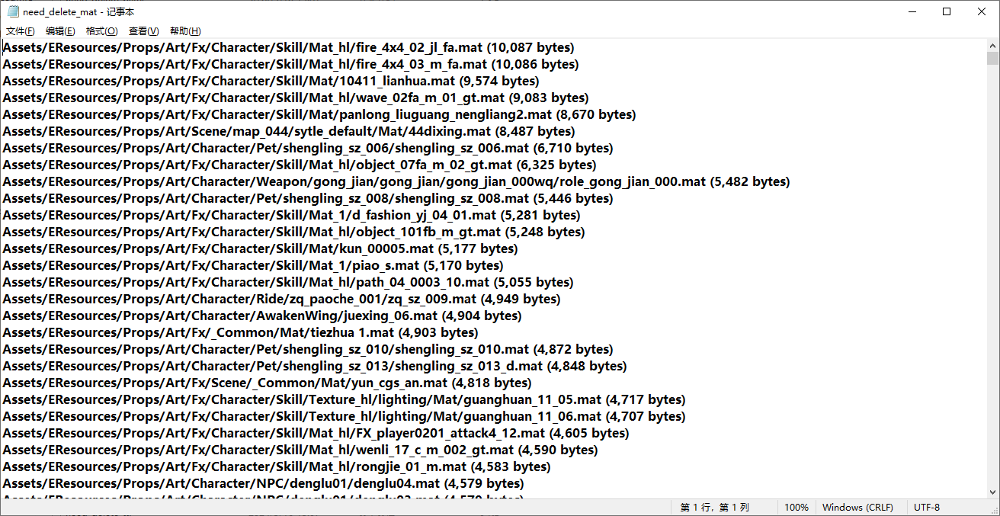
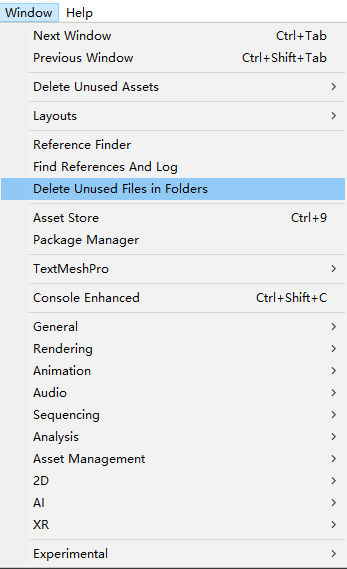
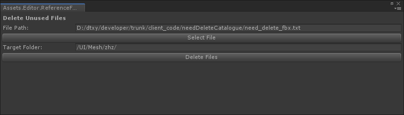

## How to use

### Copy code to your project catalogue Assets/Editor

### Select menu/window/Find References And Log

### Inspection results

#### dependencedInfoCatalogue/

#### needDeleteCatalogue/

### Select menu/Window/Delete Unused Files in Folders

Select the file path and target folder and click delete

